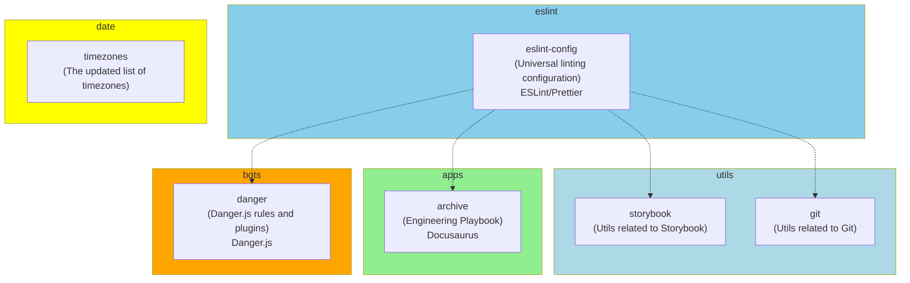

# Runespoor Stack

- [Runespoor Stack](#runespoor-stack)
  - [🛠️ Contributing](#️-contributing)
  - [Monorepo](#monorepo)
  - [Merge Request CI](#merge-request-ci)
  - [Main CI](#main-ci)
  - [💕 Special Thanks](#-special-thanks)
  - [❤️ Support or Donate](#️-support-or-donate)

## 🛠️ Contributing

See the [CONTRIBUTING.md](https://github.com/runespoor-engineering/runespoorstack/blob/main/CONTRIBUTING.md) document.

## Monorepo

## Merge Request CI

## Main CI

## 💕 Special Thanks

- I want to say thank you to the best woman in the world, **my wife Diana** for her love, daily support, motivation and inspiration.

## ❤️ Support or Donate

If you are enjoying this work and feel extra appreciative, you could [buy me a book](https://bmc.link/borisshulyak)
📖 or 3 📖📖📖.