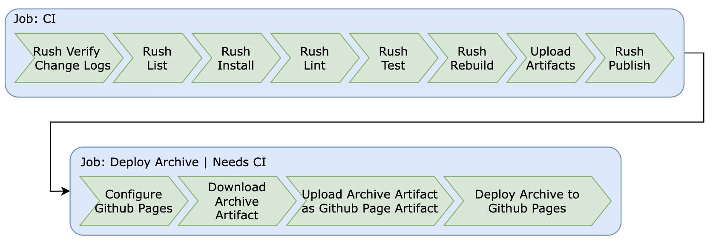

# Runespoor Stack

- [Runespoor Stack](#runespoor-stack)
  - [🛠️ Contributing](#️-contributing)
  - [Monorepo](#monorepo)
  - [Monorepo Packages](#monorepo-packages)
  - [Merge Request CI](#merge-request-ci)
  - [Main CI](#main-ci)
  - [💕 Special Thanks](#-special-thanks)
  - [❤️ Support or Donate](#️-support-or-donate)

## 🛠️ Contributing

See the [CONTRIBUTING.md](https://github.com/runespoor-engineering/runespoorstack/blob/main/CONTRIBUTING.md) document.

## Monorepo

## Monorepo Packages

| Path | Description |
|-----------|-------------|
| apps/archive | A set of documents that may help you to increase overall efficiency for team members and the whole team in general, and to strive to be better engineers. |
| bots/danger | The Runespoor set of PR linters using Danger.js |
| feature-toggles/feature-toggles-imperative | Imperative feature toggles as code for JavaScript and TypeScript. |
| eslint/eslint-config | Battle tested, ready for production set of Runespoor ESlint configs. |
| cli/changelog | The Runespoor CLI for changelog management and semantic versioning. |
| utils/storybook | The Runespoor set of Storybook utils. |
| utils/git | The Runespoor set of Git utils. |
| utils/filesSystem | The Runespoor set of files system utils. |

## Merge Request CI

## Main CI

## 💕 Special Thanks

- I want to say thank you to the best woman in the world, **my wife Diana** for her love, daily support, motivation and inspiration.

## ❤️ Support or Donate

If you are enjoying this work and feel extra appreciative, you could [buy me a book](https://bmc.link/borisshulyak)
📖 or 3 📖📖📖.
