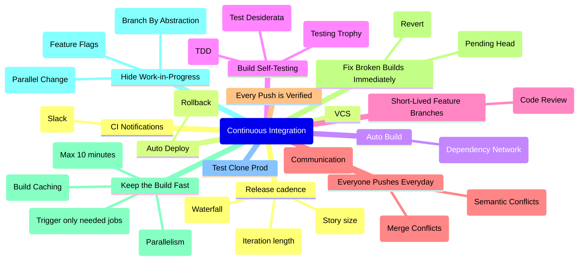
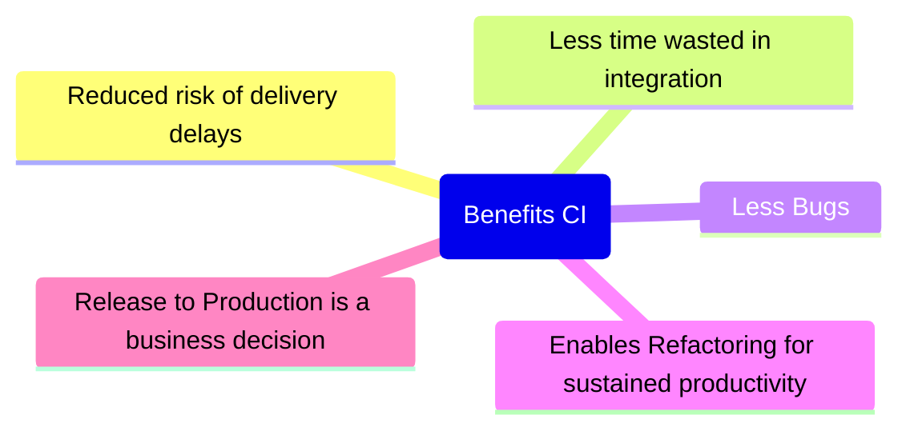

# Continuous Integration

Integration is primarily about communication. Integration allows developers to tell other developers about the changes they have made.

There are significant benefits to reducing the size of features from two months to two weeks. Continuous Integration has the advantage of setting high-frequency integration as the baseline, setting habits and practices that make it sustainable.

Continuous Integration makes a point of setting integration frequency as a target in itself, and not binding it to feature completion or release frequency.

A development team wanting to go ahead with Trunk-Based Development have prerequisite achievements. Once the team has done a few commits in the correct style, other things are now facilitated. We can show this as a layer cake:

DevOps is encompassing too. At the very least, the expansion of development best practices into operations heartlands.

## Low vs High Frequency Integration

There are two very obvious differences here. Firstly the high-frequency integration, as the name implies, has a lot more 
integrations - twice as many just in this toy example. But more importantly these integrations are much smaller than those in the low-frequency 
case. Smaller integrations mean less work, since there's less code changes that might hold up conflicts. But more importantly than less work, 
it's also less risk. The problem with big merges is not so much the work involved with them, it's the uncertainty of that work. Most of the time 
even big merges go smoothly, but occasionally they go very, very, badly. That occasional pain ends up being worse than a regular pain. If I compare 
spending an extra ten minutes per integration with a 1 out of fifty chance of spending 6 hours fixing an integration - which do I prefer? If I just 
look at the effort, then the 1-in-50 is better, since it's 6 hours rather 8 hours and twenty minutes. But the uncertainty makes the 1-in-50 case 
feel much worse, an uncertainly that leads to integration fear.

## Practices of Continuous Integration

### Release cadence

- **Iteration length:** If you are on a four week, or more iteration length, and each of those four weeks varies with proximity to the release and cannot change that you may be in a bind. You may be able to follow the tenets of Trunk-Based Development, benefit from a Continuous Integration daemon (as all branching models can), but you are not going to be able to get all the way to Continuous Delivery (or Continuous Deployment).
- **Waterfall:** This one is easy. If you are doing waterfall, you are not close at all to the “do not break the build” mantra required to do Trunk-Based Development. Consider a short-iteration Agile methodology like Extreme Programming.
- **Story size:** Trunk-Based Development needs you to have small stories/tasks. Optimal is you starting work on a change, should only be a matter of hours before completing and pushing it forward for code review. Longer than a couple of days, and there is going to be pressure to group a bunch of developers on a non-trunk branch and merge back later. Or worse, have developers make branches/forks from your in-progress branch. Or worse still, take intermediate merges from your branch, despite your change being incomplete.

### Put everything in a version controlled mainline

- I should be able to walk up with a laptop loaded with only an operating system, and by using the repository, obtain everything I need to build and run the product.
- It should be easy to find the code for a given piece of work.

### Automate the Build

- Any instructions for the build need to be stored in the repository, in practice this means that we must use text representations.
- As builds get more complicated it's better to use a tool that's designed with build automation in mind.
- Use a [Dependency Network](https://martinfowler.com/dslCatalog/dependencyNetwork.html) - a dependency network organizes its logic into tasks which are structured as a graph of dependencies.
- A common mistake is not to include everything in the automated build: anyone should be able to bring in a clean machine, check the sources out of the repository, issue a single command, and have a running system on their own environment.
- While a simple program may only need a line or two of script file to build, complex systems often have a large graph of dependencies, finely tuned to minimize the amount of time required to build things.

### Make the Build Self-Testing

- If bugs make their way into the product, then we are faced with the daunting task of performing bug fixes on a rapidly-changing code base. Manual testing is too slow to cope with the frequency of change.
- A programmer's job isn't done merely when the new feature is working, but also when they have automated tests to prove it.
- We should be confident that if the tests are green, then no significant bugs are in the product.
- Any test failing is enough to fail the build, 99.9% green is still red.
- Often the biggest barrier to implementing Continuous Integration is insufficient skill at testing.
- TDD is the best way to write self-testing code.
- Follow the "Engineering Playbook/**Testing**" section.

### Continuous Short Lived Feature Branches and  Code Review

- Either as branching directly off main, or in a fork of the whole repository. These branches are destined to come back as “pull requests” into the main/trunk.
- With the Pull Request (and code review) advance, the cut-off point for team sizes that graduated from “direct to the trunk” to short lived feature branches moved lower. While it was up to 100 before Git’s lightweight branching, it is now up to 15 people. With 16 or more, the team is more productive with short-lived feature branches, and corresponding CI daemons verifying those in advance of commits landing in the trunk.
- One key rule is the length of life of the branch before it gets merged and deleted. Simply put, the branch should only last a couple of days. Any longer than two days, and there is a risk of the branch becoming a long-lived feature branch (the antithesis of trunk-based development).
- Another key rule is how many developers are allowed congregate on a short-lived feature branch. Another simple answer: the developer count should stay at one (or two if pair-programming). These short-lived feature branches are not shared within a team for general development activity. They may be shared for the purposes of code review, but that is entirely different to writing production code and tests.
- It allows you to provide the Continuous Code Review. Follow the "Engineering Playbook/**Code Review**" section.
- Teams doing Trunk-Based Development know that their commits/pushes will be scrutinized by others, as soon as they have landed on the shared trunk. They are keen on bringing that forward, not delaying it, so they may prefer to pair-program on code changes. Or they may ask colleagues for a code review at the time the change is submitted to be merged into the trunk.

### Everyone Pushes Commits To the Mainline Every Day

- No code sits unintegrated for more than a couple of hours.
- Integration allows developers to tell other developers about the changes they have made.
- With developers committing every few hours a conflict can be detected within a few hours of it occurring, at that point not much has happened and it's easy to resolve. Conflicts that stay undetected for weeks can be very hard to resolve.
- The easiest to find and resolve are Merger Conflicts. The harder problem are [Semantic Conflicts](https://martinfowler.com/bliki/SemanticConflict.html). This is why it's so important to have self-testing code.

### Every Push to Mainline Should Trigger a Build

- We thus need to ensure that every commit is verified in a reference environment.

### Fix Broken Builds Immediately

- Continuous Integration can only work if the mainline is kept in a healthy state.
- Nobody has a higher priority task than fixing the build.
- Usually the best way to fix the build is to revert the latest commit from the mainline, taking the system back to the last-known good build.
- Some teams prefer to remove all risk of breaking the mainline by using a [Pending Head](https://martinfowler.com/bliki/PendingHead.html) (also called Pre-tested, Delayed, or Gated Commit.)

### Keep the Build Fast

- Nothing sucks the blood of Continuous Integration more than a build that takes a long time.
- The XP guideline of a ten minute build is perfectly within reason.
- The most crucial step is to start working on setting up a Deployment Pipeline.
- One way to speed things up is to use parallelism and multiple machines.
- Another one is trigger only the needed jobs in the pipeline.
- One more is build caching.

### Hide Work-in-Progress

- Continuous Integration means integrating as soon as there is a little forward progress and the build is healthy.
- Integrate even before a user-visible feature is fully formed and ready for release.
- Teams doing Continuous Integration ensure that all code sent to the mainline is production quality, together with the tests that verify the code. Latent code may never be executed in production, but that doesn't stop it from being exercised in tests.
- Use [Feature Flags](https://martinfowler.com/bliki/FeatureFlag.html).
- Use [Branch By Abstraction](https://martinfowler.com/bliki/BranchByAbstraction.html) for managing latent code in large infrastructural changes within a code base.
- Use [Parallel Change](https://martinfowler.com/bliki/ParallelChange.html) (aka expand-contract) to always ensure that we can rollback in case of problems.

### Test in a Clone of the Production Environment

- If we test in a different environment, every difference results in a risk that what happens under test won't happen in production.
- We want to set up our test environment to be as exact a mimic of our production environment as possible.
- We run production software in containers, and reliably build exactly the same containers for testing, even in a developer's workspace.

### Everyone can see what's happening

- We want to ensure that everyone can easily see the state of the system and the changes that have been made to it.
- One of the most important things to communicate is the state of the mainline build.
- Link your CI Service with other tools to broadcast build information to internal social media tools such as Slack.
- As well as the current state of the build, these displays can show useful information about recent history, which can be an indicator of project health

### Automate Deployment

- It's important to have scripts that will allow us to deploy the application into any environment easily.
- It's always should be possible to rollback any deployment.

### Development Flow

## Benefits of Continuous Integration

### Reduced risk of delivery delays.

- It's very hard to estimate how long it takes to do a complex integration.
- The longer the time between integrations, the more code to integrate, the longer it takes - but what's worse is the increase in unpredictability.
- This all makes pre-release integration a special form of nightmare. Because the integration is one of the last steps before release, time is already tight and the pressure is on.
- The less integration there is to do, the less unknown time there is before a new release is ready.
- The integrations are so small that they usually proceed without comment. An awkward integration would be one that takes more than a few minutes to resolve.
- Even if a team isn't releasing to production regularly, Continuous Integration is important because it allows everyone to see exactly what the state of the product is.

### Less time wasted in integration

- If there's twice as much code to integrate, it's more likely to be four times as long to carry out the integration.
- In organizations that are using feature branches, much of lost time is felt by the individual. Several hours spent trying to rebase on a big change to mainline is frustrating.
- A few days spent waiting for a code review on a finished pull request, which another big mainline change during the waiting period is even more frustrating.
- aving to put work on a new feature aside to debug a problem found in an integration test of feature finished two weeks ago saps productivity.

### Less Bugs

- This is less because of the high-frequency integration and more due to the essential introduction of self-testing code. Without decent tests, we can't keep a healthy mainline.
- If a bug appears due to a semantic conflict, it's easy to detect because there's only a small amount of code to be integrated.
- Seeing how often introducing a change means introducing bugs, people conclude that to have high reliability software they need to slow down the release rate.

### Enables Refactoring for sustained productivity

- A team that refactors regularly has a disciplined technique to improve the structure of a code base by using small, behavior-preserving transformations of the code. These characteristics of the transformations greatly reduce their chances of introducing bugs, and they can be done quickly, especially when supported by a foundation of self-testing code.
- Applying refactoring at every opportunity, a team can improve the structure of an existing codebase, making it easier and faster to add new capabilities.
- A two week refactoring session may greatly improve the code, but result in long merges because everyone else has been spending the last two weeks working with the old structure. Frequent integration solves this dilemma by ensuring that both those doing the refactoring and everyone else are regularly synchronizing their work. When using Continuous Integration, if someone makes intrusive changes to a core library I'm using, I only have to adjust a few hours of programming to these changes. If they do something that clashes with the direction of my changes, I know right away, so have the opportunity to talk to them so we can figure out a better way forward.

### Release to Production is a business decision

- Imagine we are demonstrating some newly built feature to a stakeholder, and she reacts by saying - “this is really cool, and would make a big business impact. How long before we can make this live?” If that feature is being shown on an unintegrated branch, then the answer may be weeks or months, particularly if there is poor automation on the path to production.
- Continuous Integration allows us to maintain a Release-Ready Mainline, which means the decision to release the latest version of the product into production is purely a business decision. If the stakeholders want the latest to go live, it's a matter of minutes running an automated pipeline to make it so.
- Continuous Integration and a Release-Ready Mainline removes one of the biggest barriers to frequent deployment. Frequent deployment is valuable because it allows our users to get new features more rapidly, to give more rapid feedback on those features, and generally become more collaborative in the development cycle. This helps break down the barriers between customers and development - barriers which I believe are the biggest barriers to successful software development.

## Basic MR CI/CD Pipeline (FE)

## Basic Main CI/CD Pipeline (FE)

## Resources

In order to follow this methodology, you must know and follow every word from this material:
- [Patterns for Managing Source Code Branches](https://martinfowler.com/articles/branching-patterns.html#continuous-integration)
- [Semantic Conflict](https://martinfowler.com/bliki/SemanticConflict.html)
- [Dependency Network](https://martinfowler.com/dslCatalog/dependencyNetwork.html)
- [Diff Debugging](https://martinfowler.com/bliki/DiffDebugging.html)
- [Continuous Integration](https://martinfowler.com/articles/continuousIntegration.html)
- [Trunk Based Development](https://trunkbaseddevelopment.com)
- [Feature Toggles (aka Feature Flags)](https://martinfowler.com/articles/feature-toggles.html)
- [Continuous Delivery](https://continuousdelivery.com/)
- Follow the "Engineering Playbook/**Agile**" section.
- Follow the "Engineering Playbook/**Source Control**" section.
- Follow the "Engineering Playbook/**Testing**" section.
- Follow the "Engineering Playbook/**Code Review**" section.
- Follow the "Engineering Playbook/**Processes/Critical Chain**" section.
- Follow the "Engineering Playbook/**Processes/The delay in managerial decision-making**" section.

**CI Tools:**
- [PostHog](https://github.com/PostHog/posthog).
- [SonarCube](https://www.sonarqube.org/).
- [markdownlint](https://github.com/DavidAnson/markdownlint), [github-action-markdown-link-check](https://github.com/gaurav-nelson/github-action-markdown-link-check), [write-good](https://github.com/btford/write-good)
- [Dependabot](https://docs.github.com/en/code-security/dependabot/working-with-dependabot).
- [Danger](https://github.com/danger/danger-js)
- [Codecov](https://about.codecov.io/).
- [Copy-Paste analyzer](https://github.com/kucherenko/jscpd)
- [commitlint](https://github.com/conventional-changelog/commitlint)
- [conventional-changelog](https://github.com/conventional-changelog/conventional-changelog)
- [lint-staged](https://github.com/lint-staged/lint-staged)
- [dep-tree](https://github.com/gabotechs/dep-tree)
- [unimported](https://github.com/smeijer/unimported)
- [bundlesize](https://github.com/siddharthkp/bundlesize)
- [srollup-plugin-visualizer](https://github.com/btd/rollup-plugin-visualizer)
- [tsup](https://github.com/egoist/tsup)
- [github-slack](https://github.com/integrations/slack)

**Useful GitHub Actions:**
- [setup-node](https://github.com/actions/setup-node)
- [checkout](https://github.com/actions/checkout)
- [first-interaction](https://github.com/actions/first-interaction)
- [labeler](https://github.com/actions/labeler)
- [release-action](https://github.com/ncipollo/release-action)
- [git-auto-commit-action](https://github.com/stefanzweifel/git-auto-commit-action)
- [download-artifact](https://github.com/actions/download-artifact)
- [upload-artifact](https://github.com/actions/upload-artifact)
- [actions-gh-pages](https://github.com/peaceiris/actions-gh-pages)
- [codecov-action](https://github.com/codecov/codecov-action)

## CI/CD Pipeline Recommendations

- Set up it in the way to ensure that only a single job or workflow using the same concurrency group will run at a time. It will reduce costs spent on unnecessary jobs. [GitHub Example](https://docs.github.com/en/actions/writing-workflows/workflow-syntax-for-github-actions#concurrency).
- Parallelize jobs where possible.
