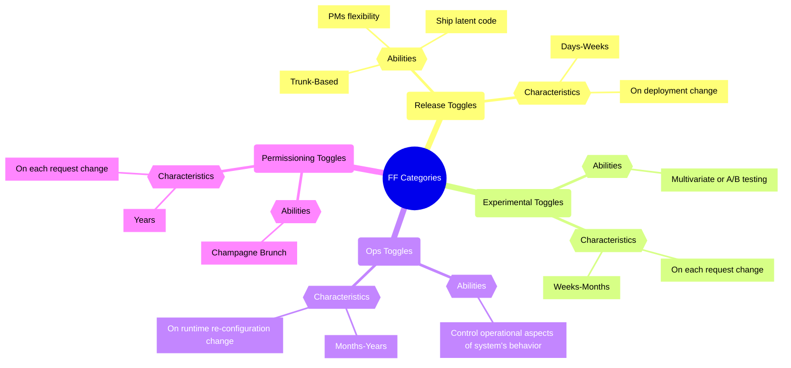
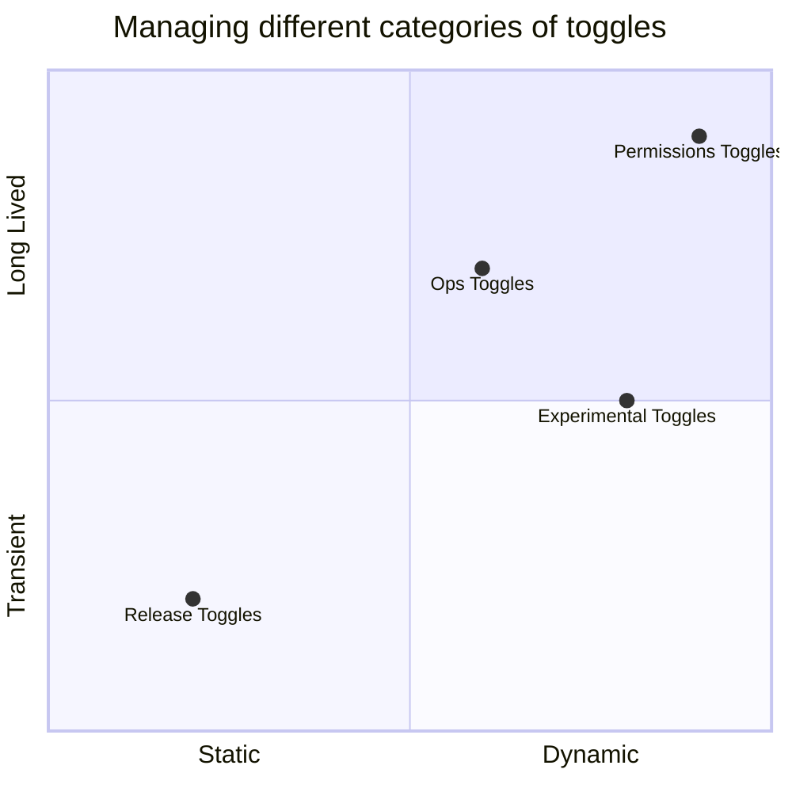
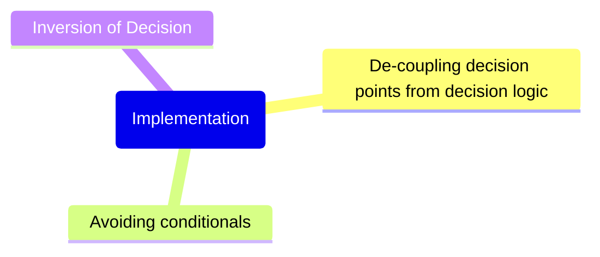
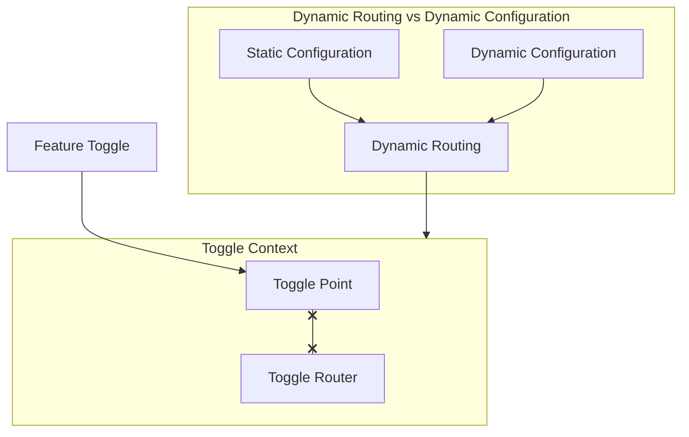
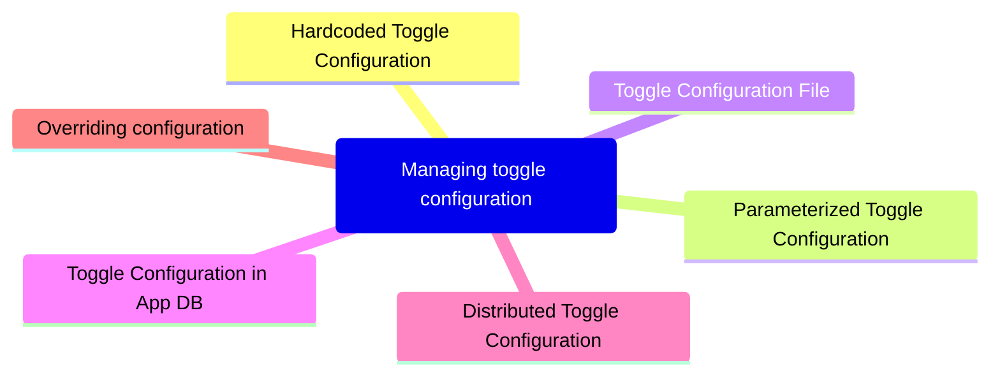
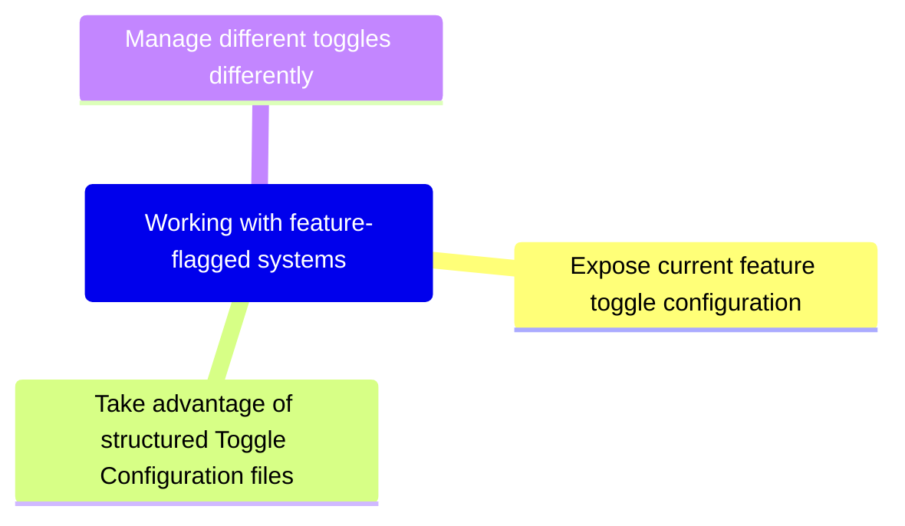

# Feature Flags

Feature Toggles (often also refered to as Feature Flags) are a powerful technique, allowing teams to modify system behavior without changing code.
They fall into various usage categories, and it's important to take that categorization into account when implementing and managing toggles. 
Toggles introduce complexity. We can keep that complexity in check by using smart toggle implementation practices and appropriate tools to 
manage our toggle configuration, but we should also aim to constrain the number of toggles in our system.

## Used Infro

- [Feature Toggles (aka Feature Flags)](Feature Toggles (aka Feature Flags))

## Basic Feature Flag Birth

1. Added some boolean (or other type) toggle value + conditional logic based on this value.
2. Make the toggle value configurable and dynamic in order to change the behavior of the system without changing the code.
3. Prepare for release, make manual testing on Pre-Production environment and test both code paths.
4. Canary releasing
5. A/B testing
6. Release

## Categorization

Feature Flags can be used in various ways in various contexts. It can be tempting to lump all feature toggles into the same bucket, 
but this is a dangerous path. The design forces at play for different categories of toggles are quite different and managing them all 
in the same way can lead to pain down the road.

Feature toggles can be categorized across two major dimensions: 
- How long the feature toggle will live.
- How dynamic the toggling decision must be.

### Release Toggles

**Abilities:**
- Used to **enable trunk-based** development for teams practicing **Continuous Delivery**. 
- Allow incomplete and un-tested codepaths to be shipped to production as **latent code** which may never be turned on.
- Allow product-managers to **not show a partly or fully ready feature to end users** (for many reasons).

**Characteristics:**
- **Loves form Days to Weeks** - generally not stick around much longer than a week or two (although product-centric toggles may need to remain in place for a 
longer period).
- **Changes with deployment** - every toggling decision for a given release version will be the same, and changing that toggling decision by 
rolling out a new release with a toggle configuration change is usually perfectly acceptable.

### Experiment Toggles

**Abilities:**
- Used to perform **Multivariate or A/B testing** - each user of the system is placed into a cohort and at runtime the Toggle Router will consistently 
send a given user down one codepath or the other, based upon which cohort they are in.

**Characteristics:**
- **Lives from Weeks to Months** - needs to remain in place with the same configuration long enough to generate statistically significant results. 
(Longer is unlikely to be useful, as other changes to the system risk invalidating the results of the experiment).
- **Changes with each request, highly dynamic** - each incoming request is likely on behalf of a different user and thus might be routed differently 
than the last.

### Ops Toggles

**Abilities:**
- Used to control operational aspects of our system's behavior - we might introduce an Ops Toggle when rolling out a new feature which has unclear 
performance implications so that system operators can disable or degrade that feature quickly in production if needed.

**Characteristics:**
- **Lives from Moths to Years** - Most Ops Toggles will be relatively short-lived - once confidence is gained in the operational aspects of 
a new feature the flag should be retired. However it's not uncommon for systems to have a small number of long-lived "Kill Switches" which 
allow operators of production environments to gracefully degrade non-vital system functionality when the system is enduring unusually high load.
- **Chanes with runtime re-configuration** - Since the purpose of these flags is to allow operators to quickly react to production issues 
they need to be re-configured extremely quickly - needing to roll out a new release in order to flip an Ops Toggle is unlikely to make an 
Operations person happy.

### Permissioning Toggles

**Abilities:**
- Used to change the features or product experience that certain users receive. - Turning on new features for a set of internal users [is a] Champagne Brunch - an early opportunity to drink your own champagne.
  - A Champagne Brunch is similar in many ways to a Canary Release. The distinction between the two is that a Canary Released feature is exposed to a randomly selected cohort of users while a Champagne Brunch feature is exposed to a specific set of users.

**Characteristics:**
- **Lives from Years** - When used as a way to manage a feature which is only exposed to premium users a Permissioning Toggle may be very-long lived compared to other categories of Feature Toggles - at the scale of multiple years.
- **Changes with each request** - Since permissions are user-specific the toggling decision for a Permissioning Toggle will always be per-request, making this a very dynamic toggle.

## Managing different categories of toggles

**Static vs Dynamic:**
- Toggles which are making runtime routing decisions necessarily need more sophisticated Toggle Routers, along with more complex configuration 
for those routers.
- For simple static routing decisions a toggle configuration can be a simple On or Off for each feature with a toggle router which is just 
responsible for relaying that static on/off state to the Toggle Point.

**Transient vs Long Lived:**
- If we're adding a Release Toggle which will be removed in a few days time then we can probably get away with a Toggle Point which does 
a simple if/else check on a Toggle Router.
- However if we're creating a new Permissioning Toggle with Toggle Points which we expect to stick around for a very long time then we certainly 
don't want to implement those Toggle Points by sprinkling if/else checks around indiscriminately. We'll need to use more maintainable 
implementation techniques.

## Implementation Techniques

## Toggles Configuration

### Dynamic routing vs dynamic configuration

It's important to note that there are two ways in which a flag's decisions might change at runtime. Firstly, something like a Ops Toggle 
might be dynamically re-configured from On to Off in response to a system outage. Secondly, some categories of toggles such as Permissioning 
Toggles and Experiment Toggles make a dynamic routing decision for each request based on some request context such as which user is making 
the request. The former is dynamic via re-configuration, while the later is inherently dynamic. These inherently dynamic toggles may make 
highly dynamic decisions but still have a configuration which is quite static, perhaps only changeable via re-deployment.

**Note:** on the previous chart we could see all the part of Feature Toggles. Let's understand what each of them means:
- **Feature Toggle** - a boolean (or any other type) value which is used to determine whether a feature is enabled or disabled.
- **Toggle Point** - the place where a toggling decision is made.
- **Toggle Router** - the logic behind the decision.
- **Toggle Context** - teaches the Toggle Router how to make dynamic, per-request toggling decisions.
- **Static Configuration** - a configuration which is quite static, perhaps only changeable via re-deployment.
- **Dynamic Routing** - a dynamic routing decision for each request based on some request context such as which user is making the request.
- **Dynamic Configuration** - a configuration which is quite dynamic, perhaps changeable via re-configuration.

### Prefer static configuration

- Managing toggle configuration via source control and re-deployments is preferable, if the nature of the feature flag allows it.
- Managing toggle configuration via source is like infrastructure as code - allows toggle configuration to live alongside the codebase 
being toggled, which provides a really big win: toggle configuration will move through your Continuous Delivery pipeline in the exact 
same way as a code change or an infrastructure change would.
- This enables the full the benefits of CD - repeatable builds which are verified in a consistent way across environments.
- It also greatly reduces the testing burden of feature flags. There is less need to verify how the release will perform with both a 
toggle Off and On, since that state is baked into the release and won't be changed (for less dynamic flags at least).
- We can easily see the state of the toggle in previous releases, and easily recreate previous releases if needed.

## Approaches for managing toggle configuration

## Working with feature-flagged systems

## Feature Toggles introduce validation complexity

- With feature-flagged systems our Continuous Delivery process becomes more complex, particularly in regard to testing. 
- While a feature-flagged release candidate does need testing with a few toggle configurations, it is not necessary to test *every* possible 
combination. Most feature flags will not interact with each other, and most releases will not involve a change to the configuration of more 
than one feature flag.
- It's most important to test the toggle configuration which you expect to become live in production, which means the current production toggle 
configuration plus any toggles which you intend to release flipped On.
- It's also wise to test the fall-back configuration where those toggles you intend to release are also flipped Off.
- To avoid any surprise regressions in a future release many teams also perform some tests with all toggles flipped On.
- A good convention is to enable existing or legacy behavior when a Feature Flag is Off and new or future behavior when it's On.

## Where to place your toggle

### Toggles at the edge

- For categories of toggle which need per-request context (Experiment Toggles, Permissioning Toggles) it makes sense to place Toggle Points 
in the edge services of your system - i.e. the publicly exposed web apps that present functionality to end users.
- A side-benefit of placing Toggle Points at the edge of your system is that it keeps fiddly conditional toggling logic out of the core of your system.
- Placing Toggle Points at the edges also makes sense when you are controlling access to new user-facing features which aren't yet ready for launch.
- It's interesting to note that with some of these types of feature flag the bulk of the unreleased functionality itself might actually be 
publicly exposed, but sitting at a url which is not discoverable by users.

### Toggles in the core

- There are other types of lower-level toggle which must be placed deeper within your architecture.
- These toggles are usually technical in nature, and control how some functionality is implemented internally.
