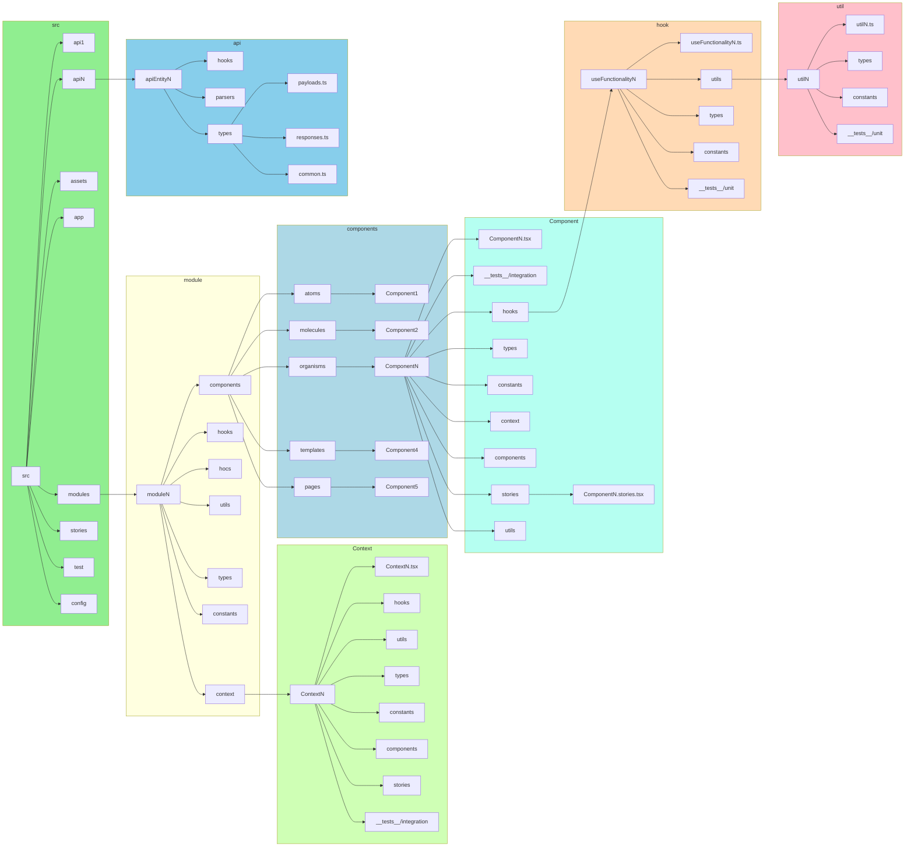
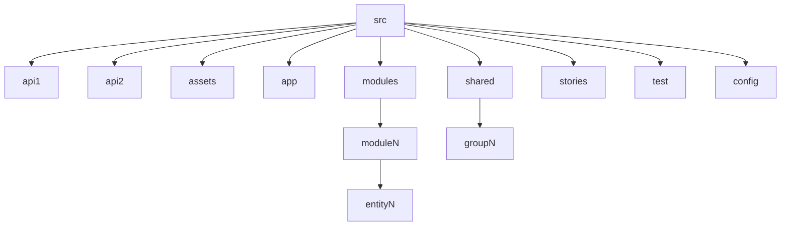
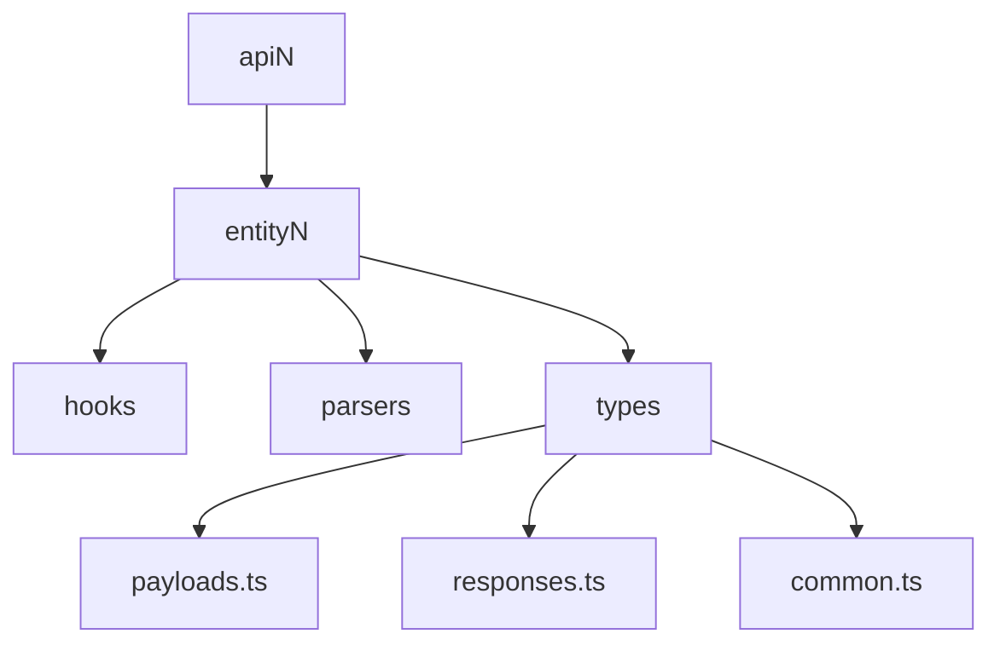
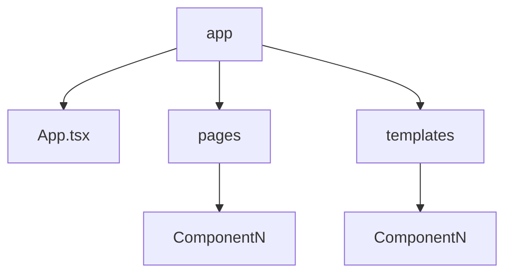
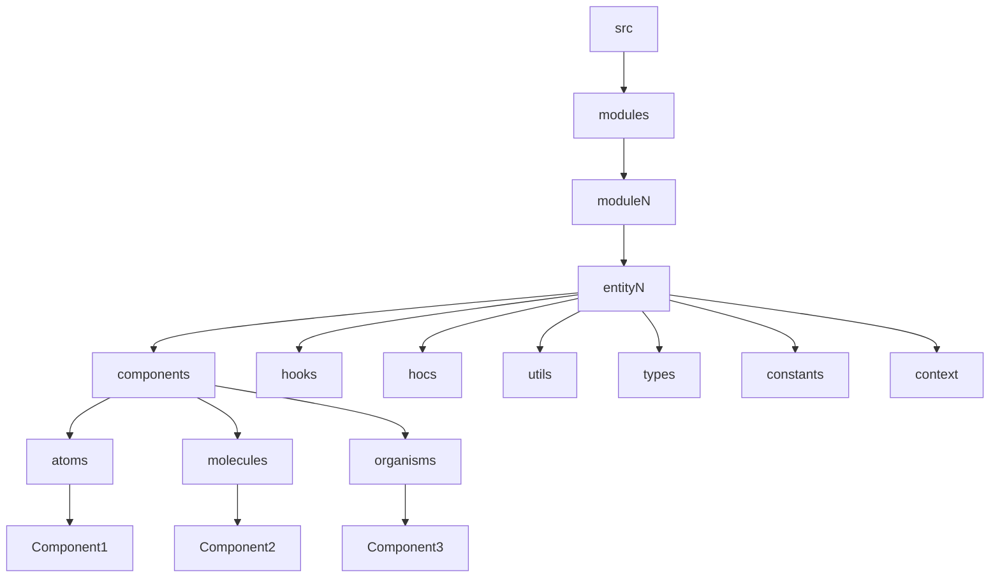
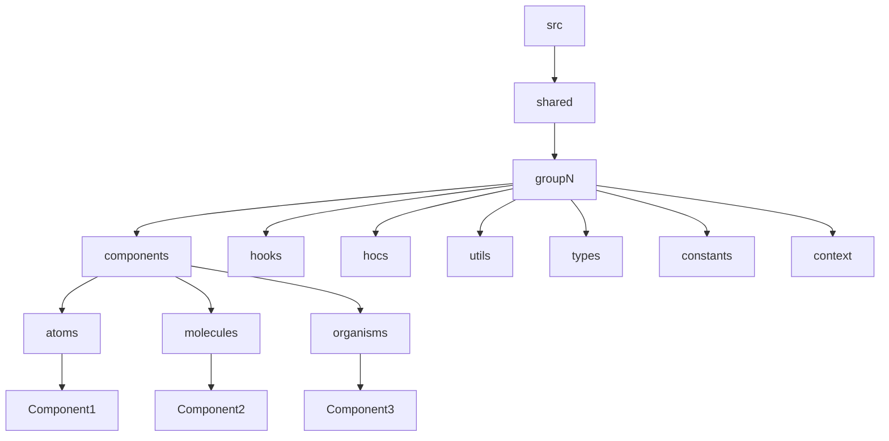
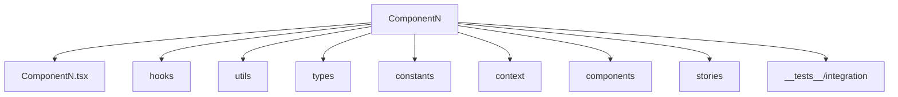
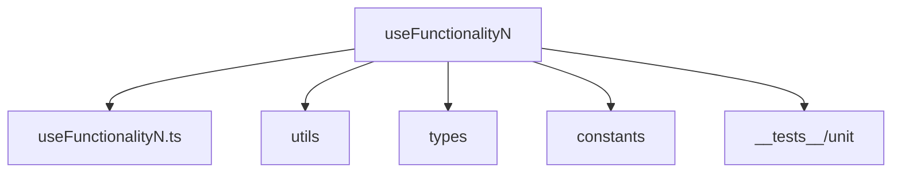
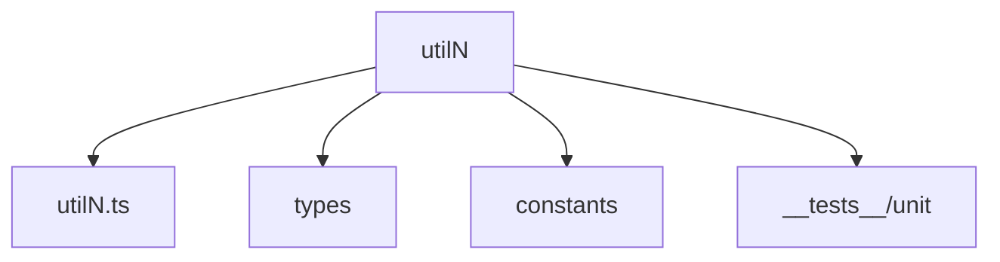
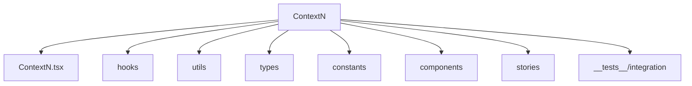

# Simple React Files Structure

There is a few silver bullet rules for (modules) **hooks**, **utils**, **types**, **constants**, **components**, etc. placing:
- If it is a general module - it should be placed on the highest level (e.g. src).
- If it is used in 2 or more modules - it should be placed on the higher level of it's usage or in the module folder.



## Src



```
src/
  <api> - is used for everything related to server API (api, hooks, types, parsers). There could be more that one `api` folder, e.g. `apiGitLab`, `apiJira`.
  assets - is used for static asserts.
  app - is used App.tsx component, pages, and templates components.
  modules - is used for splitting app entities by modules. Entities are used for splitting components, hooks, etc. by the app entities.
  shared - is used for separating shared components, hooks, etc. shared folder contains groups folders
  stories - general stories, documentation.
  test - tests setup files.
  config - app configuration files.
```

## Api

- **api.ts** - file for api ednpoints.
- **hooks.ts** - file for api hooks (e.g. wrapers over `useQuery`, `useMutation` in case of Tanstack Query).
- **types** - folder for the server api entities, payload, and responses types.
- **parsers.ts** - file for the server api response parsers.



```
api /
  <entity1>
    api.ts
    hooks.ts
    types / 
      payloads.ts
      responses.ts
      common.ts
    parsers.ts
  <entityN>
    api.ts
    hooks.ts
    types / 
      payloads.ts
      responses.ts
      common.ts
    parsers.ts
```

## App Folder

- App foldre is used for the main App component, pages, and templates components.



```
app /
  App.tsx
  pages /
    <Component1>
    <ComponentN>
  templates /
    <Component1>
    <ComponentN>
```

## Modules Folder

- Split your app by modules and by entities inside the modules.
- Inside the **entity/components** folder create the **atoms**, **molecules**, **organisms** folders.
- Inside the components **atoms**, **molecules**, **organisms** folders create the separate folders for each component. 
Follow the [Atomic Design](https://atomicdesign.bradfrost.com/chapter-2/) in organization of your exported components.
- I suggest creation  folders as the separate modules.
- Store the **hooks**, **utils**, **types**, **constants**, **context** in the module folder that are fully related to this 
module and shared across different component in the module.



```
src/
  modules /
    <module1> /
      <entity1> /
        components /
          atoms
            <Component1>
          molecules
            <Component2>
          organisms
            <Component3>
        hooks
        hocs
        utils
        types
        constants
        context
    <moduleN> /
      <entityN> /
        components /
          atoms
            <Component1>
          molecules
            <Component2>
          organisms
            <Component3>
        hooks
        hocs
        utils
        types
        constants
        context
```

## Shared Folder
- Split separate your shared fucntionality and split it by groups.



```
src/
  shared /
    <group1> /
      components /
        atoms
          <Component1>
        molecules
          <Component2>
        organisms
          <Component3>
      hooks
      hocs
      utils
      types
      constants
      context
    <groupN> /
     components /
        atoms
          <Component1>
        molecules
          <Component2>
        organisms
          <Component3>
      hooks
      hocs
      utils
      types
      constants
      context
```

## Component

- **hooks** - folder for hooks related to this component directly or 2 or more components in the `<Comonent1>/components` folder.
- **utils** - folder for utility functions related to this component directly or 2 or more components in the `<Comonent1>/components` folder.
- **types** - folder for types related to this component directly or 2 or more components in the `<Comonent1>/components` folder.
- **constants** - folder for constants related to this component directly or 2 or more components in the `<Comonent1>/components` folder.
- **context** - folder for context related to this component directly.
- **components** - folder for nested components. 
  - If some components are used only in this component, they should be placed under this component.
  - If some components are used in 2 or more components, they should be placed on the higher level.
- **stories** - folder for stories related to this component directly.
- **\_\_tests\_\_/integration** - folder for tests related to this component directly (if includes testing integration with server api) 
OR **\_\_tests\_\_/component** (if does not include testing integration with server api).



```
<Component1>
  Component1.tsx
  hooks
  utils
  types
  constants
  context
  components
  stories
  __tests__/<integration/component>
```

## Hook

- **utils** - folder for utility functions related for this hook directly.
- **types** - folder for types related for this hook directly.
- **constants** - folder for constants related for this hook directly.
- **__tests__/unit** - folder for tests related for this hook directly.



```
<useFunctionality1>
  useFunctionality1.tsx
  utils
  types
  constants
  __tests__/unit
```

## Util

- **types** - folder for types related for this util directly.
- **constants** - folder for constants related for this util directly.
- **\_\_tests\_\_/unit** - folder for tests related for this util directly.



```
<util1>
  util1.tsx
  types
  constants
  __tests__/unit
```

## Context

- **Context1.tsx** - Use the singe file for Context and Provider.
- Other folders follow the same rules.



```
context /
  <group1>
    <Context1> / 
      Context1.tsx
      hooks
      utils
      types
      constants
      components
      stories
      __tests__/<integration/component>
  <groupN>
    <ContextN>
```

## Stories

```
stories /
  <Component1>.stories.tsx
```
