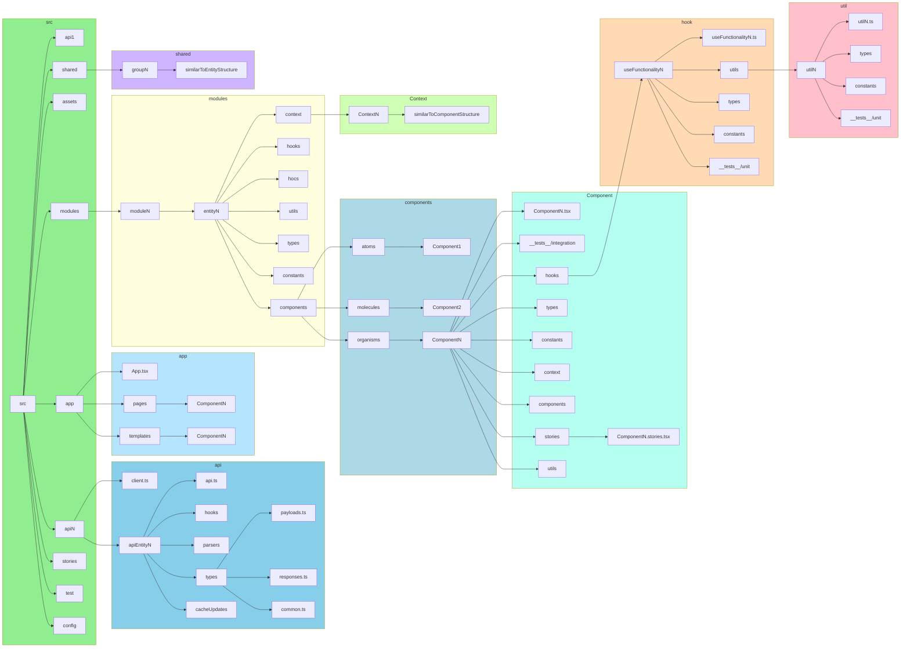
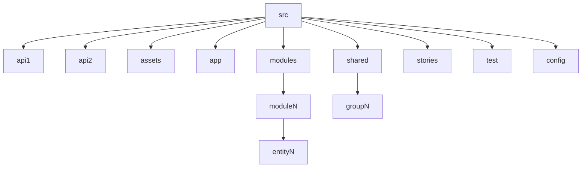
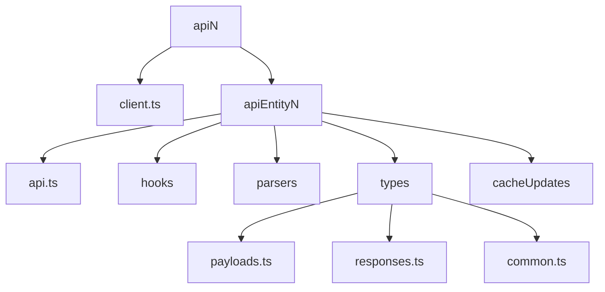
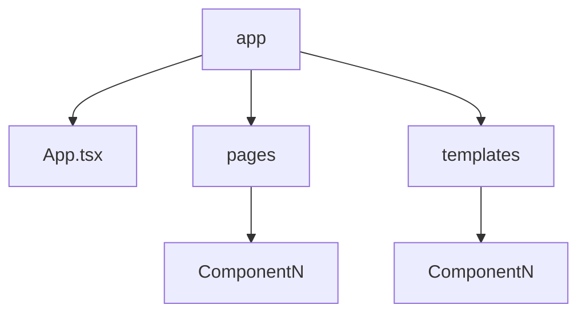
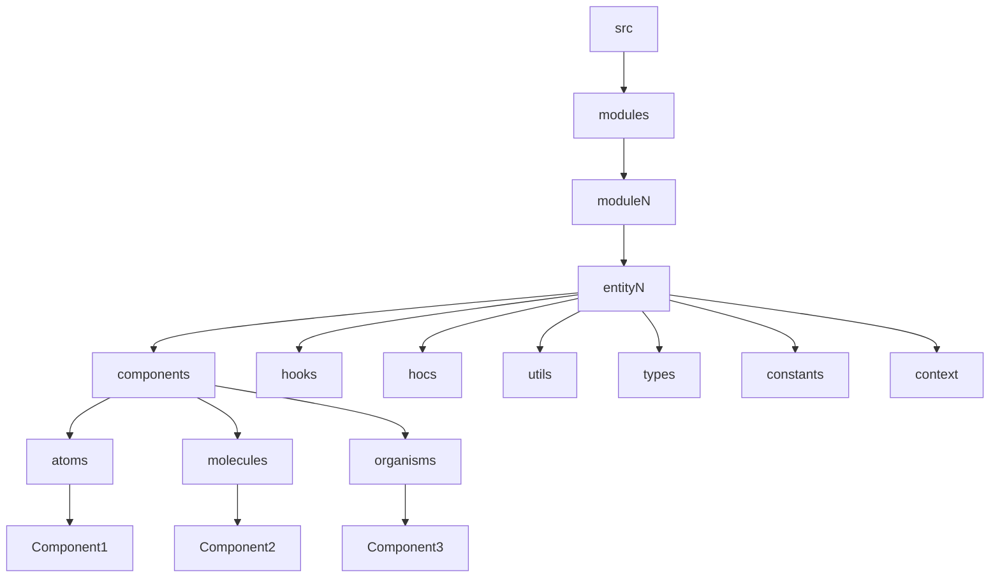
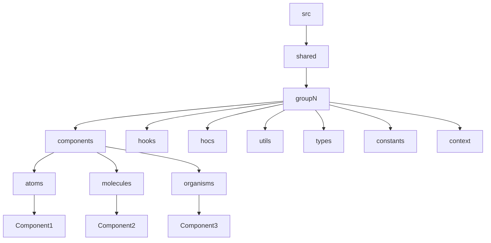
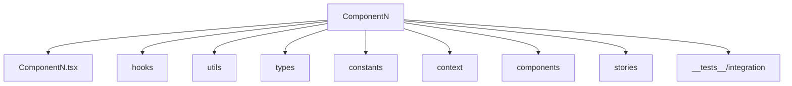
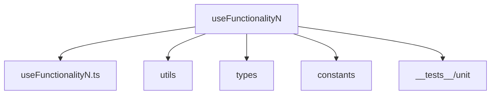
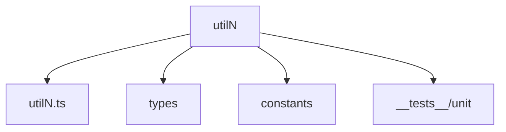
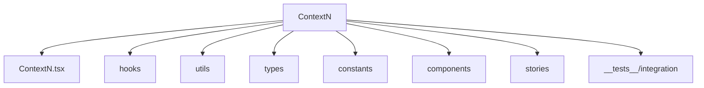

# Simple React Files Structure



## Src



```
src/
  <apiN> 
  assets
  app
  modules
  shared
  stories
  test
  config
```

## Api



```
<apiN> /
  client.ts
  <entity1>
    api.ts
    hooks.ts
    cacheUpdates.ts
    types / 
      payloads.ts
      responses.ts
      common.ts
    parsers.ts
  <entityN>
    api.ts
    hooks.ts
    cacheUpdates.ts
    types / 
      payloads.ts
      responses.ts
      common.ts
    parsers.ts
```

## App Folder



```
app /
  App.tsx
  pages /
    <Component1>
    <ComponentN>
  templates /
    <Component1>
    <ComponentN>
```

## Modules Folder



```
src/
  modules /
    <module1> /
      <entity1> /
        components /
          atoms
            <Component1>
          molecules
            <Component2>
          organisms
            <Component3>
        hooks
        hocs
        utils
        types
        constants
        context
    <moduleN> /
      <entityN> /
        components /
          atoms
            <Component1>
          molecules
            <Component2>
          organisms
            <Component3>
        hooks
        hocs
        utils
        types
        constants
        context
```

## Shared Folder



```
src/
  shared /
    <group1> /
      components /
        atoms
          <Component1>
        molecules
          <Component2>
        organisms
          <Component3>
      hooks
      hocs
      utils
      types
      constants
      context
    <groupN> /
     components /
        atoms
          <Component1>
        molecules
          <Component2>
        organisms
          <Component3>
      hooks
      hocs
      utils
      types
      constants
      context
```

## Component



```
<Component1>
  <Component1.tsx>
  hooks
  utils
  types
  constants
  context
  components
  stories
  __tests__/<integration/component>
```

## Hook



```
<useFunctionality1>
  <useFunctionality1.tsx>
  utils
  types
  constants
  __tests__/unit
```

## Util



```
<util1>
  <util1.tsx>
  types
  constants
  __tests__/unit
```

## Context



```
context /
  <group1>
    <Context1> / 
      <Context1.tsx>
      hooks
      utils
      types
      constants
      components
      stories
      __tests__/<integration/component>
  <groupN>
    <ContextN>
```

## Stories

```
stories /
  <Component1>.stories.tsx
```
