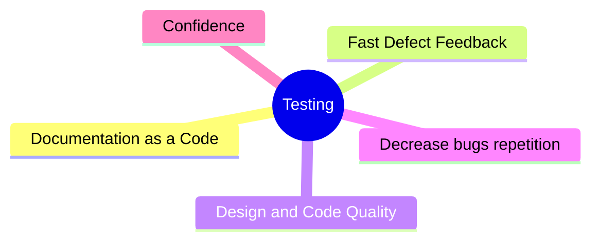

# Why Automated Testing?

## Why should we use automated testing?

### Documentation as Code

Tests are the best documentation for your code. It's documentation that evolves with your code. Tests demonstrate how the code 
should work, what data it expects, and what data it returns. Understanding a piece of code that is covered by tests is much 
easier than dealing with code that isn’t covered:

- You can simply read the test cases (it messages) to understand what the code does.
- You can look at the test bodies to see the format of the input data and the actions required to achieve the expected result.
- Tests serve as a manual that documents all of your code.

This makes onboarding new developers onto a project easier and faster. Working with unfamiliar or old code becomes faster.

### Design and Code Quality

The worse your code, the harder it is to write tests for it, and vice versa. In fact, the earliest and most obvious signs 
of bad code are:

- Unclear what data in what format is expected as input.
- Unclear what data in what format should be the output.
- Code is not covered by static tests.
- Code is not covered by dynamic (unit, etc.) tests.

Look, don’t tests solve all these problems? Now let’s take this a step further and consider an imaginary module of even 
lower quality:

- The tested module is highly coupled with other parts of the code.
- The module violates various SOLID and GRASP principles.
- And the list goes on...

With such code, it will first be challenging to test because you’ll have to mock half the project (due to strong coupling and 
design principle violations). Second, you’ll end up rewriting the tests for this module every time you change something in it, 
and probably in other areas as well.

Believe me, this situation will frustrate you so much that you’ll inevitably start refactoring the module and improving its design.

The difficulty in covering your system with tests only indicates that your architecture could be improved. 
Use tests as an indicator of bad code:

- If a part of the code is not covered by tests, confidence in its quality decreases.
- If a part of the code is difficult to test, confidence that the system module is complex and inconvenient increases.

Tests have become such a strong indicator of code quality that practices like Test-Driven Development (TDD) and 
even Test-Driven Design (TDD) have emerged. Yes, Design... meaning designing through writing tests. Think about that.

### Confidence

Of course, tests give you confidence that your code works as expected. Is this always true? No, because many factors 
influence this. But if it works even 80% of the time - believe me, that’s more than enough.

Here are some scenarios where you’ll feel happy and confident having test coverage:

- You make changes to the code and are not afraid that something will break in another module or in the modified code itself.
- Someone else makes changes to the code or creates a new module:
  - You’re not afraid that something will break in another module.
  - Only by having tests on the newly created code can you, as a reviewer, be confident that it works as expected - otherwise, you’d 
  have to switch to the branch with the new code and manually run everything to verify it.
- You update a dependency (npm package), perhaps just a minor or patch version - without tests, you might encounter problems in half 
the system. But tests will save you.

### Fast Defect Feedback

Tests help you quickly find defects in your code. How quickly? **Right while you’re changing the code, without wasting a 
minute of your time.** Yes, you just run the tests, modify the code, and immediately see if everything remains in order. It’s 
fantastic. But let’s compare this with how it looks without tests:

- You make changes to the code, launch the application, and start manually checking all the places that might have been affected 
by the changes. And you do this every time you make a change. This is awful. But it allows you to catch potential bugs during 
development. **This feedback takes tens of minutes, but with so many checks, you’ll end up spending hours of your time each day.**
- Then you merge the code into the main branch and pass it on to a manual QA for testing. Only after their testing can you get 
feedback, but remember that the QA has other tasks as well. So, **this feedback can take days or even weeks and consumes QA time.**

The difference is significant. Tests allow you to catch defects during development, not during testing.

### Decrease Bug Repetition

It often happens that even with a module covered by tests, there are still bugs. These bugs might be from edge cases, and you 
fix them successfully. But how can you be sure you won’t be fixing the same bug again in a month? Or worse, that your teammate 
won’t have to deal with it, spending as much time on it as you did the first time? This isn’t an efficient use of time.

You can avoid this with tests. Simply add a separate `describe` block in the same test file with the prefix `(corner cases)`
 where you’ll include the bug cases you’ve found and fixed. This way, you’ll be sure the bug won’t reoccur.

Why a separate `describe` block? Given the first point (Documentation as Code), it’s best to separate the narrow bug cases 
from the main body of test cases, as they might not carry any significant information. These cases could be so specific 
that they aren’t worth paying attention to when studying the module’s functionality or requirements.

## Statistics

To understand what other engineers think about test automation, let's look at some statistics:

- Statistics Author: Jannik Lindner
- Statistics Date: August 5, 2024

### Cost Reduction

- Test automation can reduce testing costs by 40%.
- The average ROI on test automation is 600%.
- Companies can save up to 60% of their testing efforts through test automation.
- Organizations save an average of 20% in testing costs with test automation.
- Organizations achieve a return on investment of 300% with test automation.

### Defect Detection

- Test automation can reduce post-release defects by 65%.
- Test automation can improve defect detection rates by 45%.
- 85% of software defects can be identified through test automation.
- 70% of defects are detected in the early stages of the software development lifecycle through test automation.

### Efficiency Enhancement

- 44% of organizations use test automation in their software development process.
- 85% of software testers are involved in test automation projects.
- 70% of organizations have plans to increase their test automation efforts.
- Test automation improves test efficiency by 45%.
- Only 8% of companies have fully automated their testing processes.
- Test automation can improve software quality by 32%.
- 60% of testing activities can be automated.
- Test automation can help identify defects 20 times faster than manual testing.
- 75% of companies believe test automation is crucial for their Digital Transformation strategy.
- Test automation can increase test efficiency by 85%.
- 60% of test automation projects fail due to inadequate expertise.
- 73% of organizations expect to increase their investments in test automation in the next year.
- 90% of companies experience a significant increase in testing productivity with test automation.
- Test automation can boost test accuracy by 90%.
- Test automation can enhance collaboration between development and testing teams by 70%.

### Time Savings

- Companies experience an average of 60% time savings due to test automation.
- 40% of time savings can be achieved by automating test execution.
- Test automation can reduce testing time by up to 80%.
- Automation testing is 5 times faster than manual testing.
- Test automation can reduce time-to-market by 50%.
- Test automation can decrease testing time by 90%.
- Test automation can help achieve 40% faster deployment cycles.
- Test automation can result in a 50% reduction in regression testing time.
- Test automation can reduce test execution time by 50%.
- Test automation can reduce the testing cycle by 75%.
- Test automation can increase software release frequency by 40%.
- 80% of organizations report faster time to market with test automation.