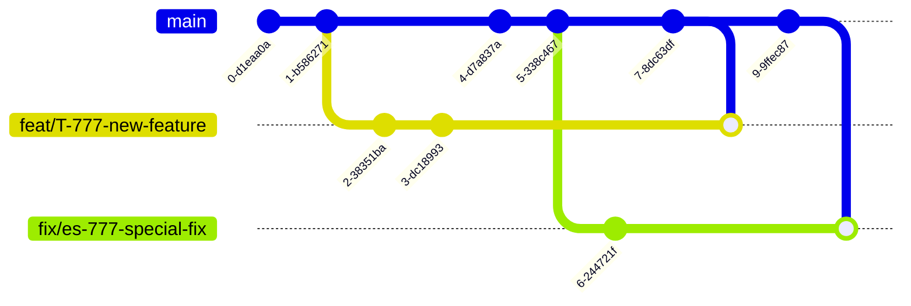

# Git Control

## Runespoor Branches Naming Convention

```markdown
<type>/<project-name>/<short-description>

docs/archive/git-control
```

## Coomon Branches Naming

```markdown
<type>/<T-777>-<short-description>

feat/T-777-linear-chart-component
```

### Type

Common **types** according to [commitlint-config-conventional (based on the Angular convention)](https://github.com/conventional-changelog/commitlint/tree/master/@commitlint/config-conventional#type-enum) can be:

- build
- chore
- ci
- docs
- feat
- fix
- perf
- refactor
- revert
- style
- test

### Ticket Hash

It is common practice to add a hash code of the ticket (e.g. Jira, ClickUp ticket) to the branch name for the next purposes:

- Integrations with time tracking plugins basically work using the ticket hash from your branch. For example, the time tracking on Jira tickets could be more easier with [Tempo VS Code extension](https://marketplace.visualstudio.com/items?itemName=Tempo.tempotimetracking).
- Using this hash you could quickly find the related ticket in your project management system.
- Could be used for changelogs generating.

### Validating Branch Name

If you want to be sure you repository has a correct branch name, you should make the validation automated. Actually, I highly recommend you to do it. For this automated checks you could use the following tools:

- [GitLab Push Rules](https://docs.gitlab.com/ee/user/project/repository/push_rules.html#validate-branch-names)
- [Danger.js](https://github.com/danger/danger-js)

## Branching Strategy

We follow the CI methodology and branching strategy

- [Continuous Integration](https://martinfowler.com/articles/continuousIntegration.html)
- [Patterns for Managing Source Code Branches](https://martinfowler.com/articles/branching-patterns.html)

**Branching Diagram**

I suggest using the [mermaid](https://mermaid.js.org/) diagrams for displaying the basic git graph:



## Conventional Commits

We are using the [conventional commits](https://www.conventionalcommits.org/en/v1.0.0/) in our repos. To automate this process we have integrated the [commitlint](https://github.com/conventional-changelog/commitlint) to check if your commit messages meet the conventional commit format.

Running the `commit` command would ask you a few questions to generate the commit message following the next rules of `@commitlint/config-conventional`. [Read more.](https://github.com/conventional-changelog/commitlint/tree/master/@commitlint/config-conventional)

## Git Configuration

Make sure it is configured correctly:

```markdown
git config --global user.name "Name Lastname"
git config --global user.email name.lastname@clover.tech
git config pull.rebase false
```