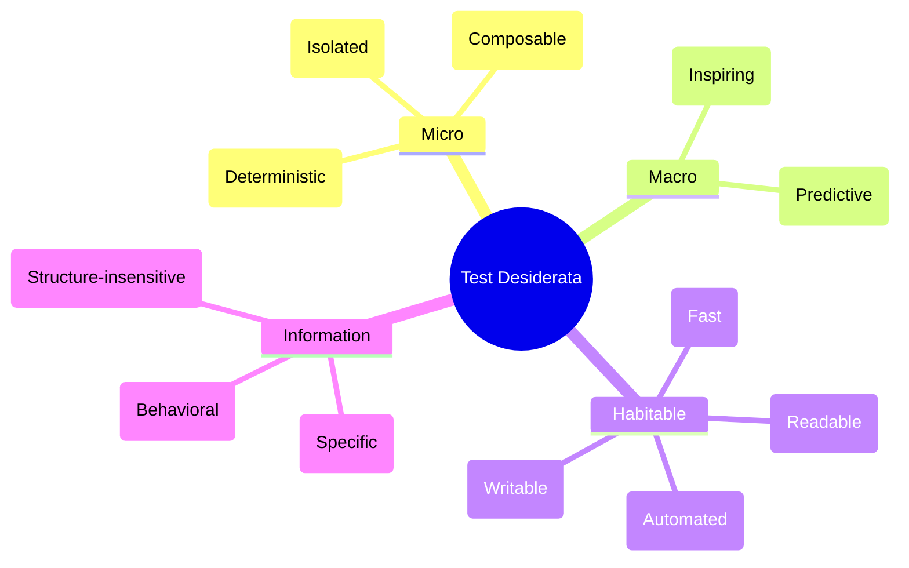

# Test Desiderata

Desiderata - things wanted or needed.

- **Isolated** — tests should return the same results regardless of the order in which they are run.
- **Composable** — I should be able to test different dimensions of variability separately and combine the results.
- **Deterministic** — if nothing changes, the test result shouldn't change.
- **Inspiring** — passing the tests should inspire confidence
- **Predictive** — if the tests all pass, then the code under test should be suitable for production.
- **Automated** — tests should run without human intervention.
- **Writable** — tests should be cheap to write relative to the cost of the code being tested.
- **Readable** — tests should be comprehensible for reader, invoking the motivation for writing this particular test.
- **Fast** — tests should run quickly.
- **Behavioral** — tests should be sensitive to changes in the behavior of the code under test. If the behavior changes, the test result should change.
- **Specific** — if a test fails, the cause of the failure should be obvious.
- **Structure-insensitive** — tests should not change their result if the structure of the code changes.
