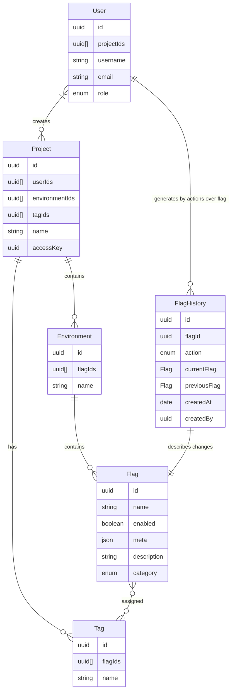

# Entity Relationships Diagram

```mermaid
erDiagram
    User {
        uuid id
        uuid[] projectIds
        string username
        string email
        enum role
    }

    Project {
        uuid id
        uuid[] userIds
        uuid[] environmentIds
        uuid[] tagIds
        string name
        uuid accessKey
    }

    Environment {
        uuid id
        uuid[] flagIds
        string name
    }

    Flag {
        uuid id
        string name
        boolean enabled
        json meta
        string description
        enum category
    }

    Tag {
        uuid id
        uuid[] flagIds
        string name
    }

    FlagHistory {
        uuid id
        uuid flagId
        enum action
        Flag currentFlag
        Flag previousFlag
        date createdAt
        uuid createdBy
    }

    User }|--o{ Project : creates
    User ||--o{ FlagHistory : "generates by actions over flag"
    Project ||--o{ Environment : contains
    Project ||--o{ Tag : has
    Environment ||--o{ Flag : contains
    Flag }o--o{ Tag : assigned
    FlagHistory ||--|| Flag : "describes changes "
```